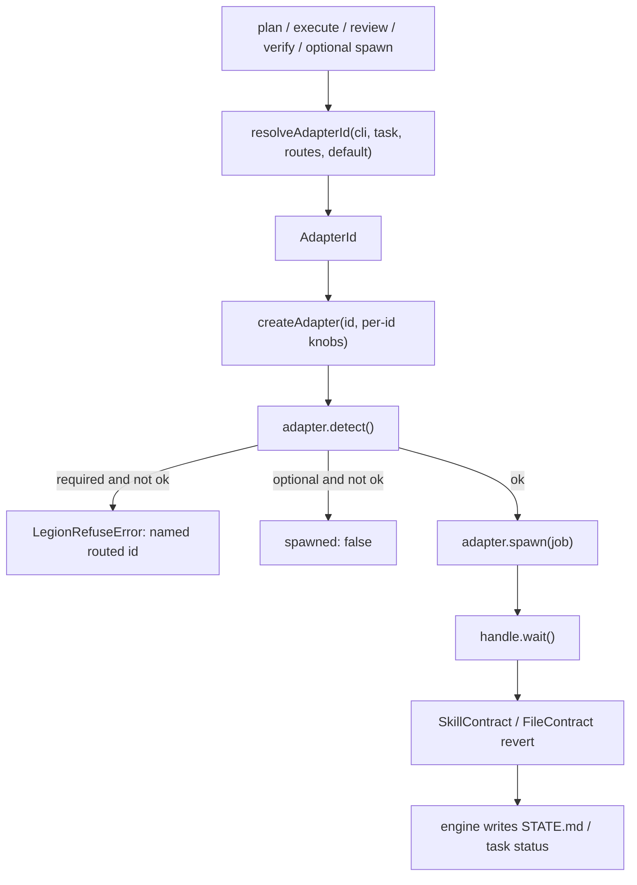

# Adapter routing — spawn-CLI routing (not an HTTP model router)

| Field | Value |
| --- | --- |
| **Title** | Adapter routing: per-task and per-skill selection of which coding-agent CLI to spawn |
| **Author** | Systems Architecture |
| **Date** | 2026-09-02 |
| **Status** | Draft (rev 4 — spawn/doctor routing landed; CLI `--adapter` override remaining) |
| **Product** | Legion CLI (`legion-cli`, npm `@9thlevelsoftware/legion-cli`) |
| **Audience** | Senior engineers implementing the feature; product leads reviewing scope |
| **Design of record** | `docs/design/product-engineering-cli.md` (rev 9 — KD5 extras spawnable; adapter routing) |
| **Git author** | 9thLevelSoftware / engineering@9thlevelsoftware.com |

---

## Overview

Legion CLI already knows how to start a coding-agent program that is installed on the laptop (`claude`, `generic`, `fake`, `grok`, `openai`, `codex`, `mimo`, `minimax`). `mcode` is the assumed PATH binary for `minimax`, not an AdapterId. It does **not** call OpenAI / xAI / MiniMax HTTP APIs, does **not** store API keys, and does **not** pick a model through a provider table. Schema already has `adapter.routes` / `adapter.named` / `Task.adapter` (adapter object `.strict()`). Agents already export `resolveAdapterId` (cli > task > route > default) and extras spawn via `ExtraAdapter`. Engine spawn (`optionalSkillSpawn`) calls `resolveAdapterId` / `isResolvedAdapterSpawnable` and persists resume adapter fields. Doctor fail-closes on required `adapter.routes` via the same spawnable path. CLI `--adapter` is still init-only. This design is the remaining one-shot CLI override.

This design adds a **second resolution step** that still yields an existing `AdapterId`. The engine then calls the current `createAdapter` / `detect` / `spawn` path unchanged. Routing is how a user gets “task A on Grok CLI, task B on Codex CLI”: Legion chooses **which already-signed-in coding CLI to launch**; that CLI talks to the model. Optional `--model` (or any other vendor flag) stays in per-id `extraArgs` / `args` argv. Existing projects that only set `adapter.default` keep today’s behavior.

`openai` is an **alias id** for the Codex CLI (`ASSUMED_EXTRA_BINARIES` maps both `openai` and `codex` to binary `codex` in `packages/schema/src/versions.ts`). Routing TSK-A → `openai` and TSK-B → `codex` is a no-op unless `adapter.openai.binary` / `args` differ. Prefer `codex` in `adapter.named` examples and human docs. Doctor still lists both ids.

---

## Background & Motivation

### Why this change is needed

Users already have several subscription coding CLIs on PATH (`grok`, `codex` from a ChatGPT subscription, `mimo`, `minimax` as `mcode`, `claude`). They want to send some work to one CLI and other work to another. That is a **spawn-routing** problem, not a **completions-proxy** problem.

The product clarification (treat as definition):

- Legion does not call vendor HTTP APIs.
- Legion starts a program already on the machine. That program is already signed in. It talks to the model.
- The same user goal (“this task on Grok, that task on MiniMax”) is achieved by routing **which coding CLI to launch**, with optional argv `--model` if the user wants that CLI to pin a model.

### Current state (snapshot 2026-09-02)

Split so “verified in code” is not a pre-PR-1 schema picture. Schema (PR-1), agents resolver (PR-2), core spawn (PR-3), and doctor fail-closed routes (PR-5) have landed; CLI `--adapter` / `--clear-adapter` on plan/execute/review/verify/fix have not.

**Already landed (schema + agents + core spawn + doctor)**

| Surface | Path | What it does |
| --- | --- | --- |
| Adapter ids | `packages/schema/src/versions.ts` | `ADAPTER_IDS = claude\|generic\|fake\|grok\|openai\|codex\|mimo\|minimax`. `EXTRA_ADAPTER_IDS` + `ASSUMED_EXTRA_BINARIES`: grok→`grok`, openai→`codex`, codex→`codex`, mimo→`mimo`, minimax→`mcode`. **`openai` and `codex` share assumed binary `codex`.** `mcode` is not an AdapterId. |
| Config | `packages/schema/src/schemas.ts` `LegionConfigSchema` | Required `adapter.default`. Per-id knobs: `claude.extraArgs`; `generic.binary`/`args`; `ExtraAdapterConfig { binary?, args? }` for extras. Optional `adapter.routes` / `adapter.named`. **No `model` / `provider` / `apiKey` / `apiBase` field.** Adapter object is **`.strict()`** — those HTTP-router keys fail parse. Generic required when default **or** any route/named target is `generic`. |
| Task | `TaskSchema` same file | Optional `adapter?: AdapterId`. Fixture `packages/persist/test/fixtures/project/legion-cli/tasks/TSK-0002.md` has no adapter key — **leave it that way.** Task is not `.strict()` (strip-unknown except the enum field). |
| Resume | `ResumeFileSchema` | Optional `adapterId`, `binary`, `argvSummary` (template), `resolutionSource`. Old resume files without them still parse. |
| Session brief | `SessionBriefSchema.currentTask` | Optional **raw** `adapter?: AdapterId`. |
| SkillContract | `SkillContractSchema` + `packages/core/src/contracts.ts` | `skillId` + `allowedRoots` only. Engine-constant write isolation, not a CLI picker. |
| Resolve | `packages/agents/src/resolve.ts` | `resolveAdapterId` (cli > task > route > default; task ignored unless execute/verify). `resolveAdapter(config, { id? })` then `createAdapter`. Generic without `binary` throws `AdapterConfigError` when the **resolved** id is generic. `isResolvedAdapterSpawnable(config, id?)`. |
| Detect-only | `packages/agents/src/types.ts` | `DETECT_ONLY_ADAPTER_IDS = []`. Extras **are spawnable** via `ExtraAdapter` (`packages/agents/src/adapters/extra.ts`) with generic-style `{{pointer}}` argv. |
| Frozen argv | `packages/agents/src/argv.ts` `FROZEN_ARGV_TABLE` + `templateArgv` | Extra adapters spawnable, generic-style argv. Pointer prompt is frozen (`packages/agents/src/pointer.ts`). Adapters build argv **internally**; `AgentHandle` does not expose argv. `templateArgv` leaves `{{pointer}}` unexpanded. |
| Env allowlist | `packages/agents/src/env.ts` `filterSpawnEnv` | Base PATH/HOME/TERM keys always. Provider credentials via `ADAPTER_CREDENTIAL_KEYS` only for the spawned adapter (`grok` → `GROK_API_KEY`/`XAI_API_KEY`, `openai`/`codex` → `OPENAI_API_KEY`, `minimax` → `MINIMAX_API_KEY`). Windows also inherits `SYSTEMROOT`, `WINDIR`, `SYSTEMDRIVE`, `PATHEXT`. `SSH_AUTH_SOCK` inherited when present, never injected. |
| Spawn | `packages/core/src/spawn.ts` `optionalSkillSpawn` | `resolveAdapterId` then `isResolvedAdapterSpawnable`. Required skills refuse if the **resolved** id is not spawnable; optional skills return `{ spawned: false, resolution }`. Resume writes `adapterId` / `binary` / names-only `argvSummary` / `resolutionSource` **before** `wait()`. |
| Engine | `packages/core/src/engine.ts` | Plan/execute/review/verify assert spawnable on the **resolved** id (`isResolvedAdapterSpawnable`). `ExecuteOptions.adapter` and `AmendTaskOptions.adapter` / `clearAdapter` exist (clear + adapter are mutually exclusive). Plan asserts, **then** writes `phase: planning`, **then** spawns. |
| Doctor | `packages/cli/src/doctor.ts` | Fail-closed if `adapter.default` missing or not spawnable via `isResolvedAdapterSpawnable` (detect, not PATH-only). Fail-closed on required-skill routes (`routes.plan` / `execute` / `review`). Warns on optional-skill routes, `adapter.named`, and slice `Task.adapter`. Trust-warns per-id args after `redactSecrets`. CLI depends on agents. |
| Dashboard writes | `packages/dashboard/src/write.ts` | `ENGINE_WRITE_METHODS = ticket \| wikiTrust \| qaChecklist`. `parseTicket` does not read `adapter`. Viewer may show raw `Task.adapter`. |
| Wiki brief | `packages/wiki/src/brief.ts` | Depends on persist + schema only — **not** agents. May copy **raw** `Task.adapter`; does not call `resolveAdapterId`. |

**Still to land (this RFC — CLI override)**

| Surface | Path | What it does today |
| --- | --- | --- |
| Plan prompt | `engine.plan` `promptBody` + `skills/plan/SKILL.md` | Lists required task frontmatter keys. **Does not mention `adapter`.** extra.json example has no `adapter`. |
| CLI `--adapter` | `packages/cli/src/cli.ts` + `init.ts` | **Init only** (already accepts every AdapterId). `execute` / `plan` / `review` / `verify` / `fix` have no adapter flag. `legion-cli fix` calls `engine.execute(task.id, { fix: true })` (`packages/cli/src/fix.ts`). Persistent task adapter is `task amend --adapter` / `--clear-adapter` once those flags exist. |
| Audit | `packages/persist/src/audit.ts` + engine `#audit("execute", …)` | Execute records duration/timeout/status/runId plus adapter fields from spawn. Plan/review/verify do not currently emit spawn audit types. |

**Design of record (rev 9):** KD5 and §5.1 of `docs/design/product-engineering-cli.md` say extras are **spawnable** (`DETECT_ONLY_ADAPTER_IDS` empty; `AdapterNotEnabled` is a dead path). Pre-rev-9 text said `grok`/`codex` were v0 detect-only. This design **does not** put extras back on detect-only. It builds on the spawnable extras that already exist.

### Pain points

1. One workspace, one CLI: a UI-heavy task cannot run on Grok while a backend task runs on Codex without rewriting `adapter.default` between commands — unless the user sets `Task.adapter` / `adapter.routes` (landed) or a one-shot CLI `--adapter` (not landed).
2. Changing `adapter.default` is a workspace-wide footgun (plan, review, and the next execute all move) without per-invocation override.
3. Resume now records which CLI ran; execute audit includes the same fields. Plan/review/verify still lack dedicated spawn audit types.
4. Doctor fail-closes on default and required-skill routes via `isResolvedAdapterSpawnable`. Remaining gap is the CLI `--adapter` flag so a one-shot override does not require editing the task file.

### Constraints carried forward (no exception unless noted)

- Legion CLI does not call vendor HTTP APIs. Auth is whatever the installed CLI already uses. Never store API keys in Legion config.
- No product-default adapter. `adapter.default` remains **required**.
- Frozen/generic argv + pointer prompt. Extra adapters stay generic-style until vendor flags are verified.
- Engine, not the spawn, writes `STATE.md`, task `status`, `lastReadiness`, `lastReview`.
- FileContract / SkillContract revert after `wait()`.
- Dashboard remains a viewer, not a completions proxy. Ticket POST does not accept `adapter`.
- Env allowlist is inherit-if-set only; Legion never writes those keys into config or tasks.

---

## Goals & Non-Goals

### Goals

1. **Resolution:** a second step that yields an existing `AdapterId`, then current `createAdapter` / `detect` / `spawn`. Fallback **only** to required `adapter.default`. Never invent an id. Never HTTP.
2. **Per-task routing:** `TSK-0001` → Grok CLI, `TSK-0002` → Codex CLI, persisted on the task file and git-reviewed.
3. **Skill-level routing:** optional config so `plan` can spawn Grok while `execute` defaults to Claude, without a product-default adapter.
4. **One-shot override:** `--adapter <id>` on `plan`, `execute`, `review`, `verify`, and `fix` (fix forwards into `ExecuteOptions.adapter`). No intent/discuss/spec CLI flags in v1.
5. **Model choice stays argv:** `--model` via existing `claude.extraArgs` / `generic.args` / `adapter.<id>.args`. No `provider` / `model` / `apiKey` / `apiBase` fields. Config parse **rejects** those HTTP-router keys on the adapter object (`.strict()`).
6. **Fail-closed on the routed adapter:** required skills (`plan`, `execute`, `review`) refuse if the **resolved** id is not spawnable (`resolveAdapter(config, { id })` then `await isSpawnable`, same as spawn); optional skills skip spawn. Doctor fail-closed covers default **and required-skill routes** (`routes.plan` / `routes.execute` / `routes.review`). Optional-skill routes, named aliases, and `Task.adapter` warn only.
7. **Observability:** every spawn writes `adapterId` / template `argvSummary` on `resume.json` **before** `wait()`. Existing execute/timeout audit events gain the same fields. Brief/next/dashboard show **raw** `Task.adapter`. Resolved id is execute/fix outcome only.
8. **Compatibility:** a project with only `adapter.default` behaves exactly as today. Do not edit the TSK-0002 persist fixture.

### Non-goals

- No vendor HTTP client (OpenAI, xAI, MiniMax, Anthropic, …).
- No stored tokens / API keys in `.legion-cli/config.yaml` or task files.
- No request-time model picker UI.
- No LiteLLM / OpenRouter / Continue / Cline gateway.
- Dashboard is not a completions proxy (no POST that forwards prompts to a model). Dashboard ticket write does not accept `adapter`; inherit is engine-side only (`#fileTicketLocked`).
- No new `AdapterId` values in this feature.
- No revival of detect-only extras.
- No OS sandboxing; FileContract revert is unchanged.
- No product-default adapter if `adapter.default` is missing.
- No changing frozen pointer-prompt text or SkillContract allowed roots.
- No argv getter on `AgentAdapter` / `AgentHandle`. Template argv is derived from `FROZEN_ARGV_TABLE` + per-id config.
- No `--adapter ""`. Clear is `--clear-adapter` only.
- No intent / discuss / spec `--adapter` flags in v1.
- Not in this feature: ingest distill spawn (engine.ingest today does not call `optionalSkillSpawn`; routing applies if that spawn is added later). QA scoring stays in-process (`packages/core/src/engine.ts` `qa()`).
- Not in v1: new audit event types `plan` / `review` / `verify` / `spawn-skip`. Resume covers every spawn; execute/timeout audit is the existing trail.

---

## Key Decisions

| # | Decision | Default | Rationale |
| --- | --- | --- | --- |
| KD-R1 | **Routing is spawn-CLI selection, not a model router** | Resolve to `AdapterId` → existing `createAdapter`. No HTTP, no provider table. Adapter object is `.strict()` so `apiKey`/`apiBase`/`model`/`provider` fail config parse. | Product definition. Strip-unknown would silently eat an HTTP table. |
| KD-R2 | **Where routing lives (layered)** | Persist per-task on `Task.adapter`. Skill policy on `adapter.routes`. One-shot on CLI `--adapter`. Named aliases on `adapter.named` expand at **write** time in the CLI (`expandNamedAdapter`). SkillContract stays write-isolation only. | Task files are git-reviewed and survive resume. Skill routes cover plan/review (no task). CLI is for the operator without mutating the board. |
| KD-R3 | **Precedence** | CLI `--adapter` > `Task.adapter` (execute/verify when a task is in scope) > `adapter.routes[skillId]` > `adapter.default`. | Operator present beats durable task beats workspace policy beats required fallback. |
| KD-R4 | **`adapter.default` stays required** | Missing default still fails `LegionConfigSchema` and doctor. Fallback is only that user-set id. | KD5 of the design of record. Routing must not create a hidden product default. |
| KD-R5 | **Model stays argv** | Pin a model with `adapter.grok.args: ["--model", "grok-4", "{{pointer}}"]` (or `claude.extraArgs`). Doctor trust-warns any non-default extra args. | Extra adapters are already generic-style (`argv.ts`). |
| KD-R6 | **Refuse/doctor use `resolveAdapter(config, { id })` + `detect()`, not PATH-only and not bare `createAdapter(id)`** | One `#assertSkillSpawnable` helper, same message as spawn. Doctor calls `await isResolvedAdapterSpawnable(config, id)` (wraps `resolveAdapter(config, { id })` then `await isSpawnable` so per-id `args`/`extraArgs` and `LEGION_CLI_ADAPTER=fake` apply). Fail-closed: default + **required-skill routes** (`plan`/`execute`/`review`). Warn: optional-skill routes, named targets, parseable active-slice `Task.adapter`. Keep informational PATH matrix on `isSpawnableBinary`. CLI gains a **direct** `@9thlevelsoftware/legion-cli-agents` workspace dep in PR-5 (it has none today). | Bare `createAdapter("grok")` uses default `["{{pointer}}"]` and would green-light `adapter.grok.args: ["--model", "grok-4"]` (no pointer) while plan refuses. PATH-only has the same hole. Optional-skill routes must not fail a Claude-only laptop. |
| KD-R7 | **Audit + resume record the resolved spawn** | `resume.json` (both pre-`wait()` writes) gains `adapterId`, `binary`, **template** `argvSummary` (`{{pointer}}` unexpanded), `resolutionSource`. Execute/timeout audit `data` gains the same. | Adapters do not expose argv. Substituted argv is mostly pointer-prompt text. |
| KD-R8 | **Schema versions stay `/v1` with additive optional fields** | `Task.adapter?`, `adapter.routes?`, `adapter.named?`, resume extras. Existing YAML still parses. **Do not edit** `TSK-0002.md`. | Matches current schema practice. No migration tool. |
| KD-R9 | **Named routes expand at write, not at spawn** | CLI `expandNamedAdapter` in PR-4. `task amend --route ui` writes `adapter: grok`. Engine `amendTask` takes an already-resolved `AdapterId`. Spawn never looks up named. | Git review sees the actual CLI. Changing `named.ui` later does not silently re-route shipped tasks. |
| KD-R10 | **CLI `--adapter` is one-shot on plan/execute/review/verify/fix** | Does not write `Task.adapter` or `adapter.default`. `--until-blocked` applies the same override to every task in that invocation. `fix` forwards into `ExecuteOptions.adapter`. **No** intent/discuss/spec flags in v1. Engine `#optionalSpawn` still accepts `cliAdapter` for tests. | `legion-cli fix` is execute. Optional interview path is template-first; adding flags without `help-all.ts` is how the first draft contradicted itself. |
| KD-R11 | **Child tickets inherit parent `Task.adapter` unless a valid override is present** | Valid `--adapter` / extra.json `adapter` wins. **Invalid extra.json `adapter` is dropped → inherit parent if present, else routes/default at spawn.** Human `ticket create --adapter bogus` refuses. Dashboard ticket POST does not accept `adapter`; inherit is engine-side. | Hallucinated `"gpt-4"` must not FAIL the parent execute, and must not silently fall through to workspace default when the parent is grok. |
| KD-R12 | **Extras remain spawnable** | Do not put ids back in `DETECT_ONLY_ADAPTER_IDS`. `openai` is an alias id for the Codex CLI; prefer `codex` in named examples. | Code already ships ExtraAdapter; rev 9 KD5 records extras as spawnable. |
| KD-R13 | **Plan may write `Task.adapter`; engine validates; prompts must say so** | Invalid id → `TaskSchema` parse fail → plan FAIL (existing unreadable-task path). PR-3 updates `skills/plan/SKILL.md` **and** `engine.plan` `promptBody`: optional `adapter:` only when SPEC/DISCUSS names a spawnable `AdapterId`; never `fake` outside tests; extra.json may include `"adapter": "grok"`. | Zod will not teach the plan skill to set grok. The spawn follows SKILL.md + promptBody. |
| KD-R14 | **`--clear-adapter` is the only clear path** | `--adapter` always validates `AdapterIdSchema`. Never `--adapter ""`. `--clear-adapter` is exclusive with `--adapter` / `--route`. | Empty string is not in `ADAPTER_IDS`; Commander-on-Windows is a poor `""` channel. |
| KD-R15 | **Raw `Task.adapter` on board surfaces; resolved id on execute outcome** | Brief/next/status/dashboard show the raw field (omit when unset). Wiki does **not** import agents. `renderSessionBrief`: `Current task: TSK-0100 settings screen (grok)` when set. Status is the **current-task** line (`Current task: TSK-0100 (grok)`) plus JSON `currentTaskAdapter`, not the ready board (`next` is). `ExecuteTaskResult.adapterId` / CLI execute+fix output is the resolved id. | `buildSessionBrief` lives in wiki (persist+schema only). Duplicating precedence there is the wrong layer. Status today prints `Current task: ${currentTaskId}` only. |
| KD-R16 | **Refuse before `phase: planning`** | `#assertSkillSpawnable` (routed id) runs **before** plan writes `planning`. One helper, one message, used by assert and spawn. | Today assert-then-write-then-spawn. If only spawn learns routes, a spawnable default + missing `grok` `routes.plan` leaves the workspace stuck in `planning` on `LegionRefuseError`. |

---

## Proposed Design

### 1. Mental model

```text
User goal: "run this task on Grok"
        ↓
Legion resolves AdapterId = grok   (CLI | Task.adapter | routes.execute | adapter.default)
        ↓
createAdapter("grok", config.adapter.grok)   // existing ExtraAdapter
        ↓
spawn PATH binary `grok` with generic-style argv (optional --model in args)
        ↓
That CLI, already signed in, talks to its model
        ↓
Engine reverts vs SkillContract/FileContract, writes STATE.md / task status
```

Legion never opens `https://api.x.ai` or stores `XAI_API_KEY` in config. If `grok` needs a model pin, the user puts `--model` in `adapter.grok.args`. If the process env already has `GROK_API_KEY` / `XAI_API_KEY`, `filterSpawnEnv` passes it through (inherit-if-set).

### 2. Resolution (the new step)

Add `resolveAdapterId` next to `resolveAdapter` in `packages/agents/src/resolve.ts`. `resolveAdapter` gains an optional `id` override so callers that already resolved can construct the adapter without a second policy pass.

```ts
export type AdapterResolutionSource = "cli" | "task" | "route" | "default";

export type AdapterResolution = {
  id: AgentAdapterId;
  source: AdapterResolutionSource;
};

export function resolveAdapterId(input: {
  config: Pick<LegionConfig, "adapter">;
  skillId: SkillId;
  taskAdapter?: AdapterId | null;
  cliAdapter?: AdapterId | null;
}): AdapterResolution {
  if (input.cliAdapter) return { id: input.cliAdapter, source: "cli" };
  const taskScoped = input.skillId === "execute" || input.skillId === "verify";
  if (taskScoped && input.taskAdapter) return { id: input.taskAdapter, source: "task" };
  const routed = input.config.adapter.routes?.[input.skillId];
  if (routed) return { id: routed, source: "route" };
  return { id: input.config.adapter.default, source: "default" };
}

export function resolveAdapter(
  config: Pick<LegionConfig, "adapter">,
  options: AdapterCreateOptions & { id?: AgentAdapterId } = {},
): AgentAdapter {
  const id = options.id ?? config.adapter.default;
  if (id === "generic" && !config.adapter.generic?.binary) {
    throw new AdapterConfigError("adapter.generic is required when the resolved adapter is generic");
  }
  // existing createAdapter switch, unchanged
}
```

Also export a **template argv** helper from `packages/agents/src/argv.ts` (no adapter interface change):

```ts
export function templateArgv(
  id: AgentAdapterId,
  config: Pick<LegionConfig, "adapter">,
): { binary: string; argv: readonly string[] } {
  // fake: binary "(in-process)", argv []
  // claude: [...CLAUDE_FROZEN_ARGV, ...extraArgs, POINTER_PLACEHOLDER]
  // generic / extras: binary from config or FROZEN_ARGV_TABLE / ASSUMED_EXTRA_BINARIES;
  //                   argv = genericArgsOrDefault(config.adapter[id].args)
  // {{pointer}} is left unexpanded
}
```

Rules:

- `cliAdapter` / `taskAdapter` that are not in `ADAPTER_IDS` are a CLI/schema refuse **before** this function (Commander + Zod). The function assumes a valid `AdapterId`.
- `Task.adapter` applies only to **execute** and **verify** (the skills that have a task in scope). Plan/review/interview/discuss/spec ignore `Task.adapter` even if `currentTaskId` happens to be set — those skills are spec-level.
- Fallback is **only** `adapter.default`. No “first spawnable on PATH,” no product default, no skip to another extra.
- Routing to `generic` requires `adapter.generic.binary` even when `adapter.default !== "generic"`. Same `AdapterConfigError` shape as today, message updated from “when adapter.default is generic” to “when the resolved adapter is generic.”
- `createAdapter` / `detect` / `isSpawnable` / `ExtraAdapter.spawn` do not change. **Do not** add an argv getter on adapters.
- Export `isResolvedAdapterSpawnable(config, id?)`: `try { return await isSpawnable(resolveAdapter(config, { id })); } catch (err) { if (err instanceof AdapterConfigError) return false; throw err; }`. Doctor and `#assertSkillSpawnable` both call this so per-id knobs and `LEGION_CLI_ADAPTER=fake` cannot drift. **`isSpawnable` is async**; callers `await` it (`runDoctor` is already async).

Call graph after the change:



### 3. Where routing lives (justification)

| Candidate | Use in this design | Why |
| --- | --- | --- |
| **`Task.adapter?: AdapterId`** | **Primary per-task store** | Task markdown is the DAG of record (`packages/persist/src/store.ts` `writeTask`). Git-reviewed, survives crash/resume, visible in `legion-cli show` / dashboard. Matches “task A → Grok, task B → Codex.” |
| **`adapter.routes?: Partial<Record<SkillId, AdapterId>>`** | **Skill-level workspace policy** | Plan and review have no task. Optional skills (interview/discuss/spec/verify) need a default other than `adapter.default` without rewriting it. |
| **CLI `--adapter`** | **One-shot override** on `plan`, `execute`, `review`, `verify`, and `fix` only. Init keeps its own `--adapter` (writes `adapter.default`). | Operator in the room. `fix` is execute (`packages/cli/src/fix.ts`). No intent/discuss/spec flags in v1. |
| **`adapter.named`** | **Write-time aliases** only, expanded in CLI | `ui: grok` lets `task amend --route ui` write `adapter: grok`. Not consulted at spawn. Prefer `codex` over `openai` as the target id. |
| **SkillContract** | **Not a routing surface** | `packages/core/src/contracts.ts` `SKILL_CONTRACTS` is allowedRoots. Mixing vendor CLI into write isolation couples two policies. |
| **HTTP provider/model/apiKey table** | **Rejected** | See Alternatives. Config `.strict()` fails those keys. |

### 4. Per-task routing

New task files **may** include optional `adapter`. The persist fixture `packages/persist/test/fixtures/project/legion-cli/tasks/TSK-0002.md` stays adapter-less (default-only tests). Example of a routed task (not a fixture edit):

```yaml
---
schemaVersion: legion-cli-task/v1
id: TSK-0100
title: settings screen
status: ready
type: feature
priority: P1
specId: spec-checkin
adapter: grok
blockedBy: []
blocks: []
contract:
  filesAllowed:
    - src/settings.ts
  filesForbidden:
    - .git/**
  expectedArtifacts:
    - src/settings.ts
  verificationCommands:
    - pnpm test
assignee: agent
notes: ""
---
```

How `Task.adapter` gets set:

1. **Human:** `legion-cli task amend TSK-0100 --adapter grok` (or `--route ui` → CLI `expandNamedAdapter` writes `adapter: grok`). `runTaskAmend` already re-reads the FileContract; persisting adapter does **not** require a contract change. `amendTask` gains `adapter` / `clearAdapter` on `AmendTaskOptions` without forcing `filesAllowed` edits.
2. **Human:** `legion-cli ticket create --title "…" --adapter codex`.
3. **Plan spawn:** plan skill **may** emit `adapter:` on new `TSK-*.md` when SPEC/DISCUSS names a spawnable `AdapterId`. Engine does not invent values. Invalid id → existing “not a valid task” FAIL in `engine.plan()` (`packages/core/src/engine.ts` unreadable-task loop). PR-3 **must** teach the skill: edit `skills/plan/SKILL.md` and the plan `promptBody` (the lines that currently say `Write .legion-cli/plans/${id}.md and .legion-cli/tasks/TSK-*.md`).
4. **Inheritance:** `#fileTicketLocked` copies `parent.adapter` when the child input omits adapter or the extra.json value was dropped as invalid. `parseExtraJson` in `packages/core/src/tickets.ts` accepts optional `adapter` string; **unknown ids are dropped** (not stored, not a parse error) so a hallucinated `"gpt-4"` does not FAIL the parent execute. After drop: inherit parent if present, else leave unset (spawn uses `routes.execute` / `adapter.default`). Human `ticket create --adapter bogus` refuses. Dashboard `parseTicket` stays adapter-free; inherit still applies when `parentId` is set.

Clearing a task route: **`legion-cli task amend TSK-0100 --clear-adapter` only.** Writes omit the key (`stripUndefined`). `--adapter` always validates `AdapterIdSchema`. Never `--adapter ""`.

`assignee: human` tasks may still carry `adapter` for when they are later flipped to agent. Today `isTaskReady` in `packages/graph/src/ready.ts` does **not** look at assignee. Do not add an assignee×adapter coupling in this feature.

### 5. Skill-level routes and named aliases

`.legion-cli/config.yaml` (still `legion-cli-config/v1`):

```yaml
schemaVersion: legion-cli-config/v1
adapter:
  default: claude          # REQUIRED. No product default.
  routes:
    plan: grok             # spec-level plan spawn
    execute: claude        # used when Task.adapter is unset
    review: grok
    # interview/discuss/spec/verify/ingest/qa omitted → default
  named:
    ui: grok               # write-time alias; not read at spawn
    api: codex             # prefer codex, not openai
  claude:
    extraArgs: ["--model", "opus"]    # argv only; doctor trust-warns
  grok:
    args: ["--model", "grok-4", "{{pointer}}"]
  codex:
    args: ["{{pointer}}"]
  minimax:
    binary: mcode          # override assumed PATH name; already supported
    args: ["{{pointer}}"]
ingest:
  autoCommit: true
control_mode: guarded
```

Zod sketch (`packages/schema/src/schemas.ts`):

```ts
const AdapterRoutesSchema = z
  .object({
    interview: AdapterIdSchema.optional(),
    discuss: AdapterIdSchema.optional(),
    spec: AdapterIdSchema.optional(),
    ingest: AdapterIdSchema.optional(),
    plan: AdapterIdSchema.optional(),
    execute: AdapterIdSchema.optional(),
    verify: AdapterIdSchema.optional(),
    review: AdapterIdSchema.optional(),
    qa: AdapterIdSchema.optional(),
  })
  .strict()
  .optional();

const NamedAdapterRoutesSchema = z
  .record(
    z
      .string()
      .regex(/^[a-z][a-z0-9-]{0,31}$/)
      .refine((key) => !(ADAPTER_IDS as readonly string[]).includes(key), {
        message: "adapter.named keys must not be AdapterIds",
      }),
    AdapterIdSchema,
  )
  .optional();

// adapter object: .strict() so apiKey / apiBase / model / provider / providers / models / temperature fail parse
adapter: z.object({
  default: AdapterIdSchema,
  claude: /* existing */,
  generic: /* existing */,
  grok: ExtraAdapterConfigSchema.optional(),
  openai: ExtraAdapterConfigSchema.optional(),
  codex: ExtraAdapterConfigSchema.optional(),
  mimo: ExtraAdapterConfigSchema.optional(),
  minimax: ExtraAdapterConfigSchema.optional(),
  routes: AdapterRoutesSchema,
  named: NamedAdapterRoutesSchema,
}).strict()
```

Keep the existing refine that `adapter.generic` is required when `adapter.default === "generic"`. Add a second refine: if any `routes.*` or `named.*` value is `"generic"`, `adapter.generic` is required (else doctor/config parse would allow a route that cannot construct).

Zod refinements are **not** emitted by `z.toJSONSchema`. `packages/schema/src/json-schema.ts` `overlayJsonSchema` already hand-writes the **default === generic** `if/then`. PR-1 **must** extend that overlay so JSON Schema consumers (Ajv in `schema.test.js`) also require `adapter.generic` when any route or named target is `"generic"`. Replace the single default-only `allOf` clause with one `if/then` whose `if.adapter.anyOf` covers:

- `default: { const: "generic" }` (existing)
- each `routes.<skillId>: { const: "generic" }` (`plan`, `execute`, `review`, `verify`, `interview`, `discuss`, `spec`, `ingest`, `qa`)
- `named` present and **not** `{ additionalProperties: { not: { const: "generic" } } }` (at least one named value is `generic`; empty `named: {}` does not match)

`then` stays `{ adapter: { required: ["default", "generic"] } }`. Add a Zod **and** overlay/Ajv test: `{ adapter: { default: "claude", routes: { plan: "generic" } } }` with no `generic` block → parse fail. `{ default: "claude", routes: { plan: "grok" } }` still passes.

Empty `routes: {}` and omitted `routes` are equivalent. `init` does **not** write routes or named (compatibility).

`.strict()` on the adapter object is **new relative to today’s strip-unknown**. Default-only configs (`adapter.default` plus the known per-id knobs) still parse. A config that already smuggled `model:` or `apiKey:` will start failing parse — that is the point (KD-R1). Task schema stays strip-unknown except the optional `adapter` enum field; do not `.strict()` Task (frontmatter grows notes/human keys in the wild). HTTP-router keys on a **task** (`model:`, `provider:`) continue to strip.

### 6. Model choice (argv, not a new abstraction)

There is **no** `model`, `provider`, `apiKey`, `apiBase`, or `temperature` field on `LegionConfig` or `Task`. Those keys on `adapter:` fail parse (`.strict()`).

| Adapter | How to pin a model |
| --- | --- |
| `claude` | `adapter.claude.extraArgs: ["--model", "opus"]` — appended by `buildClaudeArgv` in `packages/agents/src/argv.ts` |
| `generic` | `adapter.generic.args` including `--model` and `{{pointer}}` |
| extras (`grok`, `codex`, `mimo`, `minimax`, `openai`) | `adapter.<id>.args` generic-style; must keep `{{pointer}}` or `detect()` fails (`ExtraAdapter.detect` in `packages/agents/src/adapters/extra.ts`) |

`openai` vs `codex`: both assumed binary `codex`. Pin a Codex model on `adapter.codex.args`. Only set `adapter.openai` when the user really wants a distinct binary/args override for the alias id.

Doctor already trust-warns `claude.extraArgs`. Extend that warning to **any** configured extra/generic args that are not exactly the frozen default `["{{pointer}}"]`. Message shape:

```text
Warnings
  claude extraArgs are set (trust warning): --model opus
  grok args are set (trust warning): --model grok-4 {{pointer}}
```

Legion does not validate that `--model grok-4` is a real Grok model. The spawned CLI does.

### 7. Spawn plumbing

`optionalSkillSpawn` (`packages/core/src/spawn.ts`) is the single chokepoint. Today:

```ts
const adapter = resolveAdapter(opts.config, { artifacts, throwAfterWrite, timedOut });
if (!(await isSpawnable(adapter))) {
  if (opts.required) refuse(`${opts.skillId} needs a spawnable adapter (run legion-cli doctor)`, HINT.doctor);
  return { spawned: false, runId, revert: null };
}
```

Change to:

```ts
export type OptionalSpawnResult = {
  spawned: boolean;
  runId: string;
  revert: RevertResult | null;
  error?: unknown;
  timedOut?: boolean;
  durationMs?: number;
  resolution?: AdapterResolution;
  binary?: string;
  argvSummary?: string;
};

// new opts: cliAdapter?: AdapterId; taskAdapter?: AdapterId

const SPAWNABLE_REFUSE = (skillId: SkillId, resolution: AdapterResolution) =>
  `${skillId} needs a spawnable adapter (${resolution.id}, via ${resolution.source})`;

const resolution = resolveAdapterId({
  config: opts.config,
  skillId: opts.skillId,
  taskAdapter: opts.taskAdapter,
  cliAdapter: opts.cliAdapter,
});
const adapter = resolveAdapter(opts.config, {
  id: resolution.id,
  artifacts: opts.fakeArtifacts ?? [],
  throwAfterWrite: opts.throwAfterWrite,
  timedOut: opts.timedOut,
});
const tmpl = templateArgv(resolution.id, opts.config);
const argvSummary = redactSecrets(tmpl.argv.join(" ")).slice(0, 240);

if (!(await isSpawnable(adapter))) {
  if (opts.required) {
    refuse(SPAWNABLE_REFUSE(opts.skillId, resolution), HINT.doctor);
  }
  return { spawned: false, runId, revert: null, resolution, binary: tmpl.binary, argvSummary };
}
```

**One helper, one message.** Engine `#assertSkillSpawnable(config, skillId, { cliAdapter, taskAdapter })` uses the same `resolveAdapterId` → `resolveAdapter(config, { id, artifacts, throwAfterWrite, timedOut })` → `isSpawnable` → `SPAWNABLE_REFUSE` path (test seam keeps fake artifacts). Production/doctor with no fake opts is `await isResolvedAdapterSpawnable(config, id)` — **never** bare `createAdapter(id)`. It replaces `#assertExecuteSpawnable` / `#assertPlanSpawnable` / `#assertReviewSpawnable`.

**Planning-phase trap:** `engine.plan` today calls `#assertPlanSpawnable` then writes `phase: planning` then spawns (`packages/core/src/engine.ts` around the `assertCanTransition(current.phase, "planning")` block). The routed assert **must** run before that write. Tests in `packages/core/test/refuses.test.js` will need string updates (messages now include id + source). Add a test: spawnable default + `routes.plan: grok` with grok not spawnable → refuse **and** phase is still `spec_frozen` / `plan_failed`, never stuck `planning`.

Execute already asserts before transitioning to `executing`; keep that order with the routed helper.

`argvSummary` is the **template** (from `templateArgv`), not the substituted process argv. `{{pointer}}` stays in the string. Do not persist env. Fake binary is `"(in-process)"`.

`resume.json` is written **before** `wait()`, twice (pid null, then pid), as today. **Both** writes include `adapterId`, `binary`, `argvSummary`, `resolutionSource`. Crash-recovery readers see the file during the run.

Engine, not spawn, still writes `STATE.md`, task status, `lastReadiness`, `lastReview`. Revert still runs in `finally` after `wait()`.

Pointer prompt, skill staging (`stageSkill`), design-context append, env allowlist (`filterSpawnEnv`), timeout (20 min), process-group abort: **unchanged**.

### 8. Doctor / refuse matrix

Doctor spawnability for default and routes uses the **same constructor as spawn**, not PATH-only and not bare `createAdapter(id)`:

```ts
// packages/agents/src/resolve.ts — also the engine assert path
await isResolvedAdapterSpawnable(config, id);
// ≡ resolveAdapter(config, { id }) → forwards grok/generic/claude.extraArgs/…
//   then await isSpawnable(adapter) → adapter.detect()
```

Bare `createAdapter("grok")` would use `genericArgsOrDefault([])` → `["{{pointer}}"]` and **miss** `adapter.grok.args: ["--model", "grok-4"]` (no pointer). That config must **fail doctor** when `routes.plan` (or execute/review) is `grok`.

**Packaging:** `@9thlevelsoftware/legion-cli` has no agents dependency today. PR-5 adds `"@9thlevelsoftware/legion-cli-agents": "workspace:*"` to `packages/cli/package.json`. Doctor imports `isResolvedAdapterSpawnable` from agents. Do **not** re-export through core for doctor (that would couple PR-5 to PR-3). Engine `#assertSkillSpawnable` (PR-3) imports the same helper from agents — core already depends on agents. Keep the informational PATH matrix on existing CLI `isSpawnableBinary` (`packages/cli/src/which.ts`) as a separate block. `isSpawnable` / `isResolvedAdapterSpawnable` are **async**; `runDoctor` already is.

| Check | Fail-closed? | Notes |
| --- | --- | --- |
| `adapter.default` present | Yes (existing) | No product default. |
| `adapter.default` spawnable | Yes | `await isResolvedAdapterSpawnable(config)` (wires default id + per-id knobs; catches missing `{{pointer}}`). |
| `adapter.routes.plan` / `execute` / `review` spawnable | **Yes** | Required skills. Unspawnable target → doctor exit 1. |
| Other `adapter.routes.*` (interview/discuss/spec/verify/ingest/qa) | Warn | Optional skills skip at runtime; a Claude-only laptop with `routes.interview: grok` still passes doctor. |
| `adapter.named[*]` target spawnable | Warn | Aliases unused until a write expands them. |
| Parseable `Task.adapter` in the **active spec slice** | Warn | `sliceTasks` of `state.activeSpecId`. Skip unreadable `TSK-*.md` (do not crash doctor). Do **not** fail-closed on task-level ids. Tasks outside the active spec are ignored. |
| PATH matrix (all ids) | Informational (existing) | Keep detecting extras even when not default. Lists both `openai` and `codex`. |
| `claude.extraArgs` / extra `args` / generic `args` ≠ default | Trust warning (extend existing) | |
| Wiki secret scan | Warning (existing) | |

`fake` stays spawnable only when `LEGION_CLI_ADAPTER=fake` (`FAKE_ADAPTER_ENV`; `FakeAdapter.detect`). Routing to `fake` as default or a **required-skill** route fails doctor in a real workspace.

Required vs optional after routing:

| Skill | Required today | Routed adapter not spawnable |
| --- | --- | --- |
| plan, execute, review | Yes | Refuse, name the id + source, **before** phase write |
| interview, discuss, spec, verify | No | Skip spawn (`spawned: false`), continue template/human path |
| ingest, qa | No spawn today | Routes reserved; no behavior change |

Doctor JSON `adapter` object grows:

```json
{
  "default": "claude",
  "spawnable": true,
  "routes": { "plan": "grok", "execute": "claude", "review": "grok" },
  "named": { "ui": "grok", "api": "codex" },
  "routed": [
    { "id": "claude", "via": "default", "skill": null, "required": true, "spawnable": true },
    { "id": "grok", "via": "routes.plan", "skill": "plan", "required": true, "spawnable": true }
  ],
  "matrix": { "claude": "on PATH", "grok": "on PATH (grok)", "openai": "on PATH (codex)", "codex": "on PATH (codex)", "…": "…" }
}
```

Human doctor output adds a Routes block under Adapter. Exit code 1 if any fail-closed check fails.

### 9. Observability

**Resume** (`packages/schema/src/schemas.ts` `ResumeFileSchema`, written in `packages/core/src/spawn.ts` **before** `wait()`):

```ts
adapterId: AdapterIdSchema.optional(), // written on new spawns; optional so old resume files parse
binary: z.string().min(1).optional(),
argvSummary: z.string().optional(),    // template argv, redacted, truncated 240
resolutionSource: z.enum(["cli", "task", "route", "default"]).optional(),
```

Do not bump `legion-cli-resume/v1`. `argvSummary` = `redactSecrets(templateArgv(...).argv.join(" ")).slice(0, 240)`. Core already depends on persist, so `redactSecrets` from `packages/persist/src/redact.ts` is fine in `spawn.ts`. Do **not** persist env.

**Audit (v1):** extend **existing** execute and timeout payloads only. Do not add new audit types `plan` / `review` / `verify` / `spawn-skip` in this feature (resume covers those spawns).

```ts
{
  durationMs,
  timedOut,
  status,          // execute only
  runId,
  adapterId,       // NEW
  binary,          // NEW
  argvSummary,     // NEW — template
  resolutionSource // NEW
}
```

`formatAuditDayLine` (`packages/persist/src/audit.ts`) appends `adapter=<id>` when `data.adapterId` is a string:

```text
- 2026-09-02T12:00:00.000Z execute phase=executing task=TSK-0100 actor=agent adapter=grok
```

`summarizeAuditMetrics` does not need a new counter in v1. `--metrics` remains local-only.

**CLI / viewer (raw vs resolved):**

| Surface | What it shows |
| --- | --- |
| `SessionBrief.currentTask.adapter` (wiki `buildSessionBrief`) | **Raw** `Task.adapter`. Omit when unset. Wiki does not import agents and does not call `resolveAdapterId`. |
| `legion-cli brief` human (`renderSessionBrief` in `packages/wiki/src/brief.ts`) | When `currentTask.adapter` is set: `Current task: TSK-0100 settings screen (grok)`. When unset, keep today’s line: `Current task: TSK-0100 settings screen`. `packages/cli/src/brief.ts` stays a pass-through of `renderSessionBrief`. |
| `legion-cli next` | Ready-task table. When `Task.adapter` is set: `TSK-0100  settings screen  P1  grok`. Omit the adapter column/suffix when unset (a task that only inherits `routes.execute` does **not** print grok here). |
| `legion-cli status` | **Not** the ready board. Human current-task line today is `Current task: ${currentTaskId}` (`packages/cli/src/status.ts` `formatHuman`). When the current task has raw `adapter`: `Current task: TSK-0100 (grok)`; otherwise unchanged. JSON keeps `currentTaskId` and adds `currentTaskAdapter: AdapterId \| null`. Plain: extra `currentTaskAdapter\tgrok` line only when set. `--blockers` output unchanged. |
| Dashboard `DashboardTask.adapter` | **Raw** field. Viewer-only; no picker. Ticket POST does not accept `adapter`. |
| `ExecuteTaskResult.adapterId` / `resolutionSource` | **Resolved** id. `legion-cli execute` / `fix` human output: `Starting TSK-0100 (settings screen) via grok.` |

### 10. Compatibility

| Existing artifact | After this feature |
| --- | --- |
| `adapter: { default: fake }` only | `resolveAdapterId` → `{ id: "fake", source: "default" }`. All tests that init `--adapter fake` stay green. |
| Task files without `adapter` | Zod optional; persist `stripUndefined` omits the key. **TSK-0002.md fixture unchanged.** |
| Resume files without `adapterId` | Optional field; readers treat missing as unknown. |
| `resolveAdapter(config)` call sites that do not pass `id` | Still default. Update engine/spawn only. |
| `engine.plan("spec-checkin")` | Still valid. New signature `plan(specId?: string, opts?: { adapter?: AdapterId })`. Same for `verify(taskId?: string, opts?: { adapter?: AdapterId })`. `review(opts?: { adapter?: AdapterId })`. `ExecuteOptions.adapter` on existing execute options bag. |
| `init --adapter` | Unchanged: writes `adapter.default`, no routes. |
| Config with unknown HTTP keys (`adapter.apiKey`) | **New:** `.strict()` fails parse. Default-only configs unaffected. |
| KD5 detect-only text (pre-rev-9 design doc) | Corrected in rev 9. Extras already spawn. This feature does not freeze them again. |

No data migration. No `schemaVersion` bump.

### 11. Sequence: per-task execute

```mermaid
sequenceDiagram
  participant U as User
  participant C as legion-cli execute
  participant E as LegionEngine
  participant R as resolveAdapterId
  participant A as ExtraAdapter grok
  participant FS as git working tree

  U->>C: execute TSK-0100
  C->>E: lock; phase plan_ready/executing; task ready
  E->>E: assertSkillSpawnable (routed id) before phase write
  E->>E: read Task.adapter=grok (no CLI override)
  E->>R: skill=execute, taskAdapter=grok
  R-->>E: { id: grok, source: task }
  E->>A: detect(); spawnable?
  alt not spawnable
    E-->>U: refuse: execute needs a spawnable adapter (grok, via task)
  else spawnable
    E->>E: writeResume(adapterId=grok, template argv, pid=null)
    E->>A: spawn(pointer prompt + FileContract)
    E->>E: writeResume(adapterId=grok, pid)
    A->>FS: grok CLI writes (trusted process)
    A-->>E: AgentResult wait()
    E->>E: revert extras vs FileContract
    E->>E: audit execute data.adapterId=grok
    E->>E: verificationCommands; task done (engine, not spawn)
    E-->>U: Starting TSK-0100 via grok. Next: legion-cli execute
  end
```

Plan is the same shape with the assert **before** `phase: planning`.

### 12. Risks

| Risk | Severity | Mitigation |
| --- | --- | --- |
| Mixed CLIs in one slice produce inconsistent code style | Med | FileContract still isolates paths. Humans set routes deliberately. Not Legion’s job to homogenize vendor CLIs. |
| Plan spawn writes junk `adapter:` values | Med | `TaskSchema` enum; unreadable → plan FAIL. SKILL.md + promptBody: set only when SPEC/DISCUSS names a spawnable AdapterId; never `fake` outside tests. extra.json unknown ids dropped then inherit. |
| CLI `--adapter` on `--until-blocked` surprises (every task in the loop uses the override) | Low | Document. Persist with `task amend` for durable per-task. |
| Routed extra missing from PATH while default is fine | Med | Doctor fails on **required-skill** route targets via `detect()`. Required refuse names id + source **before** phase write. Optional skills skip. |
| `generic` route without `adapter.generic.binary` | Low | Config refine + `resolveAdapter` `AdapterConfigError`. |
| Argv `--model` / extraArgs used to pass secrets | Med | Doctor trust warning. Template `argvSummary` + `redactSecrets`. Never add an `apiKey` field. Wiki secret scan unchanged. Resume does not persist env. |
| Stale KD5 “detect-only” docs confuse implementers | Low | Rev 9 KD5 / §5.1 + this RFC. Do not re-freeze extras. |
| Named route vs AdapterId confusion | Low | Named keys cannot be AdapterIds. Task stores AdapterId only. Prefer `codex` not `openai` in examples. |
| `AdapterNotEnabled` dead class | Low | Leave until a cleanup PR; routing must not throw it. |
| Plan refuse after writing `planning` | Med | KD-R16: assert routed id first. Test in `refuses.test.js`. |
| `.strict()` adapter object rejects unknown future knobs | Low | New extra ids are a schema PR. HTTP keys failing is intended. |

Expected load: still one serial spawn on a laptop (`flags.parallelExecute` default false). Resolution is in-process map lookups; `detect()` is PATH `which` + optional `--version` + pointer-arg check, target < 100 ms. Storage: a few YAML keys per task/config; resume grows < 1 KB.

---

## API / Interface Changes

### Schema (`@9thlevelsoftware/legion-cli-schema`)

`TaskSchema` — add optional:

```ts
adapter: AdapterIdSchema.optional(),
```

Do **not** `.strict()` Task. Do **not** change `packages/persist/test/fixtures/project/legion-cli/tasks/TSK-0002.md`.

`LegionConfigSchema.adapter` — add optional `routes`, `named` as in §5. Keep `default` required. **`.strict()`** on the adapter object. Update generic refine; add generic-required-if-routed refine. **Extend `overlayJsonSchema` in `packages/schema/src/json-schema.ts`** so the emitted `legion-config.json` requires `adapter.generic` when default **or any route/named target** is `"generic"` (Zod refinements are invisible to `z.toJSONSchema`).

`ResumeFileSchema` — add optional `adapterId`, `binary`, `argvSummary`, `resolutionSource`.

`SessionBriefSchema.currentTask` — add optional `adapter: AdapterIdSchema` (**raw** Task field). `renderSessionBrief` suffixes `(${adapter})` when set.

JSON Schema files regenerated via `packages/schema/src/emit-json-schema.ts` (`legion-config.json`, `task.json`, `resume-file.json`, `session-brief.json`). Tests in `packages/schema/test/schema.test.js` already require emit == on-disk **and** must add the generic-if-routed Ajv case to the existing overlay test.

### Agents (`@9thlevelsoftware/legion-cli-agents`)

- Export `resolveAdapterId`, `AdapterResolution`, `AdapterResolutionSource`, `templateArgv`, **`isResolvedAdapterSpawnable`**.
- `resolveAdapter(config, { id? })` — this is what spawn and doctor must call (forwards per-id knobs). Bare `createAdapter(id)` is the factory only.
- `createAdapter` switch **unchanged**. No argv getter on adapters.
- Tests: `packages/agents/test/detect.test.js` keeps “no product fallback.” Add precedence tests (cli > task > route > default; task ignored for plan; generic-without-binary throws when resolved id is generic). `templateArgv` leaves `{{pointer}}` in place and does not include the pointer-prompt body. Add: `isResolvedAdapterSpawnable` is false for `adapter.grok.args` omitting `{{pointer}}` even when `grok` is on PATH.

### Core (`@9thlevelsoftware/legion-cli-core`)

Keep positional ids. Put adapter on the existing execute options bag:

```ts
async plan(specId?: string, opts?: { adapter?: AdapterId }): Promise<Readiness>
async verify(taskId?: string, opts?: { adapter?: AdapterId }): Promise<VerifyResult>
async review(opts?: { adapter?: AdapterId }): Promise<ReviewResult>

export type ExecuteOptions = {
  untilBlocked?: boolean;
  fix?: boolean;
  adapter?: AdapterId; // NEW one-shot
};
```

Existing tests that call `engine.plan("spec-checkin")` stay green.

- `optionalSkillSpawn` opts: `cliAdapter?`, `taskAdapter?`. Result: `resolution`, `binary`, `argvSummary` (template).
- `ExecuteTaskResult`: `adapterId` / `resolutionSource` out (resolved).
- `#assertSkillSpawnable` replaces the three default-only helpers. Calls `isResolvedAdapterSpawnable` (not bare `createAdapter`). **Same refuse string as spawn.** Called **before** `phase: planning` / `executing`.
- `#optionalSpawn` (interview/discuss/spec) accepts `cliAdapter` for tests only — no CLI flags in v1.
- `NewTicket.adapter?: AdapterId`; `ticketFromInput` copies it; `#fileTicketLocked` inherits from parent when input adapter is omitted/dropped.
- `parseExtraJson`: optional `adapter`; invalid ids dropped → inherit parent if present, else unset.
- `amendTask` accepts `adapter` / `clearAdapter` in `AmendTaskOptions`. FileContract path unchanged when only adapter is edited.

Plan promptBody **and** `skills/plan/SKILL.md` (PR-3):

- Optional frontmatter `adapter:` is an `AdapterId` (`claude|generic|fake|grok|openai|codex|mimo|minimax`).
- Set it only when SPEC or DISCUSS names that coding CLI. Otherwise omit.
- Never emit `adapter: fake` outside tests.
- extra.json may include `"adapter": "grok"` (valid ids only; engine drops the rest).

Add a plan test: fixture task with `adapter: not-a-cli` → unreadable → plan FAIL (existing “not a valid task” path). Add: parent grok + extra.json `"adapter": "gpt-4"` → child inherits grok.

### CLI (`@9thlevelsoftware/legion-cli`)

| Command | Flag | Behavior |
| --- | --- | --- |
| `init` | `--adapter` (existing) | Writes `adapter.default` only |
| `plan` | `--adapter <id>` | One-shot for the plan spawn → `engine.plan(specId, { adapter })` |
| `execute [id]` | `--adapter <id>` | One-shot; with `--until-blocked` applies to every task in the loop → `ExecuteOptions.adapter` |
| `review` | `--adapter <id>` | One-shot → `engine.review({ adapter })` |
| `verify [id]` | `--adapter <id>` | One-shot → `engine.verify(id, { adapter })` |
| `fix <bug>` | `--adapter <id>` | Forwards into `engine.execute(task.id, { fix: true, adapter })` |
| `task amend <id>` | `--adapter <id>`, `--route <name>`, `--clear-adapter` | Persists `Task.adapter`. Does not require a FileContract change. |
| `ticket create` | `--adapter <id>`, `--route <name>` | Persists on the new ticket |
| `doctor` | (none) | Required-skill routes fail-closed via `isSpawnable`; trust warnings for extra args |
| `next` | (none) | Ready-task table; raw `Task.adapter` suffix when set |
| `status` | (none) | Current-task line suffix + JSON `currentTaskAdapter`; **not** the ready board |
| `brief` | (none) | `renderSessionBrief`: `Current task: TSK-0100 settings screen (grok)` when raw adapter set |

**Flag truth table** (`task amend` / `ticket create`):

| Flags | Result |
| --- | --- |
| `--adapter grok` | Persist/use `grok` |
| `--route ui` | `expandNamedAdapter` → persist that AdapterId; unknown name refuses **before write** |
| `--adapter grok --route ui` | `--adapter` wins (both valid) |
| `--adapter grok --route nope` | `--adapter` wins; do not refuse the unused bad route |
| `--clear-adapter` | Omit `Task.adapter` (`task amend` only) |
| `--clear-adapter` + `--adapter` and/or `--route` | Refuse: `--clear-adapter` is exclusive |
| `--adapter ""` / `--adapter bogus` | Refuse: `adapter must be ${ADAPTER_ID_HELP}` |
| `--route ui` with no `adapter.named` / unknown key | Refuse: `unknown named route` |

`expandNamedAdapter` lives in the **CLI package** (e.g. `packages/cli/src/adapter-route.ts`), used by `task.ts` and `ticket.ts`. Spawn and engine never call it.

Invalid `--adapter` refuses with `adapter must be ${ADAPTER_ID_HELP}` (same as init).

`packages/cli/src/help-all.ts` and Commander descriptions updated (plan/execute/review/verify/fix/`ticket create`/`task amend` flag columns). Golden transcripts that only assert init/doctor default behavior stay valid; add new transcripts for doctor-with-routes.

**No** `--adapter` on `intent` / `discuss` / `spec` in v1.

### Dashboard / MCP

`DashboardTask.adapter?: AdapterId` from **raw** task frontmatter (`toDashboardTask` in `packages/dashboard/src/snapshot.ts`, `taskCard` in `html.ts`). MCP reader may pass the raw field through if it already lists tasks; no new MCP write tool. No dashboard POST to “choose a model.”

**Explicit non-goal:** `packages/dashboard/src/write.ts` `parseTicket` / `ENGINE_WRITE_METHODS` do **not** gain `adapter`. If the POST includes `parentId`, `#fileTicketLocked` inherit still applies. Do not add `adapter` to the write allowlist.

---

## Data Model Changes

### Additive fields (no migration)

| Document | Version string | Change |
| --- | --- | --- |
| `.legion-cli/config.yaml` | `legion-cli-config/v1` | `adapter.routes?`, `adapter.named?`; adapter object `.strict()` |
| `.legion-cli/tasks/TSK-*.md` | `legion-cli-task/v1` | `adapter?: AdapterId` (optional; fixture TSK-0002 unchanged) |
| `.legion-cli/cache/runs/<id>/resume.json` | `legion-cli-resume/v1` | `adapterId?`, `binary?`, `argvSummary?` (template), `resolutionSource?` |
| Session brief (derived) | `legion-cli-brief/v1` | `currentTask.adapter?` (**raw**) |
| Audit events | `legion-cli-audit/v1` | `data.adapterId` etc. inside existing open `data` record on execute/timeout — **no schema change required** (`z.record`) |

### Explicitly not added (and rejected on config parse)

```text
adapter.providers[]
adapter.models[]
adapter.apiKey
adapter.apiBase
adapter.model
adapter.provider
adapter.temperature
Task.model
Task.provider
SkillContract.adapter
```

`.strict()` on the adapter object is how PR-1 enforces this. Task remains strip-unknown aside from the optional enum field.

### Write-time named expansion (CLI, PR-4)

```ts
// packages/cli/src/adapter-route.ts
export function expandNamedAdapter(
  config: Pick<LegionConfig, "adapter">,
  route: string,
): AdapterId {
  const id = config.adapter.named?.[route];
  if (!id) refuse(`unknown named route ${route}`, HINT.doctor /* or a small HINT.adapter */);
  return id;
}
```

Used only by CLI `task amend --route` and `ticket create --route`. Spawn never calls this. Engine `amendTask` / `fileTicket` receive an `AdapterId`.

---

## Alternatives Considered

### A1. HTTP provider / model / apiKey layer (Continue, Cline, LiteLLM, OpenRouter)

**Idea:** Legion holds `provider: xai`, `model: grok-4`, `apiKey`, `apiBase` and POSTs chat completions itself, or reverse-proxies them.

**Pros:** One Legion-owned HTTP client; request-time model picker; matches how many IDE agents work.

**Cons:** Directly contradicts the product (Legion starts a local signed-in CLI). Forces Legion to store secrets, handle OAuth, vendor rate limits, and streaming. Turns the dashboard into a completions proxy. Duplicates what `grok`/`codex`/`claude` already do. Breaks “never store API keys in Legion config.”

**Decision:** Rejected. This is the non-goal. Adapter object `.strict()` so those keys fail parse instead of stripping.

### A2. Skill-only routing (config `adapter.routes` / SkillContract, no `Task.adapter`)

**Idea:** `adapter.routes.execute: grok` and maybe `SkillContract.adapter`. Every execute uses the same CLI.

**Pros:** Smaller schema (no task field). One resolution key (`skillId`). Easy doctor.

**Cons:** Cannot express “task A on Grok, task B on Codex” without rewriting config between executes. SkillContract is allowedRoots (`packages/core/src/contracts.ts`); putting a vendor CLI there mixes isolation with routing. Plan/review still need a knob, which routes *can* provide, but per-task is the stated user goal.

**Decision:** Skill routes are **necessary but not sufficient**. They are layer 3 of precedence, not the whole feature.

### A3. CLI `--adapter` on execute only (no persistence)

**Idea:** `legion-cli execute TSK-0002 --adapter grok`. Nothing on Task or config.

**Pros:** Zero schema change. Instantly useful. Easy to implement.

**Cons:** Forgotten next session; `execute --until-blocked` and `legion-cli next` cannot show which CLI a task is bound to; CI/humans cannot git-review “this task is a Grok job”; plan/review still stuck on default; audit would only know if the flag was passed.

**Decision:** Keep as the **one-shot** layer (highest precedence), not the only layer. v1 flags: plan/execute/review/verify/**fix**. Not intent/discuss/spec.

### A4. Config map of task id → adapter (`adapter.routes.tasks.TSK-0001: grok`)

**Idea:** Keep Task schema frozen; put per-task routes in config.yaml.

**Pros:** Task files stay as they are.

**Cons:** Second source of truth next to `.legion-cli/tasks/`. Config is implicitly forbidden to spawns (`.legion-cli/config.yaml` in `IMPLICIT_FORBIDDEN`). Humans editing two files to move a task. Named ids churn when plan rewrites the board.

**Decision:** Rejected. Task file owns per-task adapter.

### A5. Persist named route on the task (`Task.route: ui`)

**Idea:** Task stores `route: ui`; spawn looks up `adapter.named.ui` live.

**Pros:** Renaming `ui` from grok → claude retargets the board.

**Cons:** Git review no longer shows which CLI will run. Silent retarget after a config edit. Two task fields (`adapter` vs `route`) for one fact.

**Decision:** Named aliases expand at **write** time in the CLI. Task stores `AdapterId`.

---

## Security & Privacy Considerations

| Topic | Handling |
| --- | --- |
| **Threat: Legion grows an HTTP completions client and harvests keys** | Non-goal. Adapter object `.strict()` rejects `apiKey`/`apiBase`/`model`/`provider`. Legion never writes keys into `.legion-cli/config.yaml` or task files. |
| **Env allowlist (inherit-if-set, never written by Legion)** | `packages/agents/src/env.ts` `ENV_ALLOWLIST`: `PATH`, `HOME`, `USERPROFILE`, `APPDATA`, `LOCALAPPDATA`, `TEMP`, `ComSpec`, `CLAUDE_API_KEY`, `GROK_API_KEY`, `XAI_API_KEY`, `OPENAI_API_KEY`, `MINIMAX_API_KEY`, `TERM`. Windows inherit: `SYSTEMROOT`, `WINDIR`, `SYSTEMDRIVE`, `PATHEXT`. `SSH_AUTH_SOCK` inherited when present, never injected into a blank env. Child CLIs may need those keys; Legion still does not store them. `argvSummary` must **not** persist env. |
| **Threat: extraArgs smuggle secrets into argv and audit** | Doctor trust-warns extra args. Template `argvSummary` runs `redactSecrets`. Audit `data` is local jsonl; `DO_NOT_TRACK` still means no phone-home (`doctor --metrics`). |
| **Threat: spawn writes `.legion-cli/config.yaml` to retarget later tasks** | Still implicit-forbidden; revert after `wait()`. |
| **Threat: plan spawn sets `adapter: fake` on every task** | Valid enum, so it parses. Execute then refuses unless `LEGION_CLI_ADAPTER=fake`. SKILL.md forbids it. Optional later harden: plan FAIL if `Task.adapter === "fake"` outside tests. Not required for v1 of this feature. |
| **Auth** | Unchanged: whatever the installed CLI already uses (Claude Code login, `codex` ChatGPT subscription, `grok` login, `mcode` login). Legion never logs in on the user’s behalf. |
| **Dashboard** | Viewer. No POST that forwards prompts. Ticket write does not accept `adapter`. Optional write surface must not gain a “complete this prompt” route. |
| **Named routes** | Keys cannot collide with AdapterIds; values are AdapterId enum only. No freeform binary names on Task (binary overrides stay under `adapter.<id>.binary` in config). |

Laptop trust model unchanged: the spawned CLI is a trusted process; FileContract is after-the-fact.

---

## Observability

Covered in Proposed Design §9. Summary:

| Signal | Where | New fields |
| --- | --- | --- |
| Per-run resume (during the run, before `wait()`) | `.legion-cli/cache/runs/<id>/resume.json` | `adapterId`, `binary`, template `argvSummary`, `resolutionSource` |
| Audit jsonl + day markdown | `.legion-cli/audit/` execute + timeout only | `data.adapterId` (and siblings); day line `adapter=` |
| Doctor | stdout/JSON | routes, named, required vs optional routed spawnable set, extra-args trust warnings, PATH matrix unchanged |
| next | CLI ready table | **raw** `Task.adapter` suffix when set |
| status | current-task line + JSON `currentTaskAdapter` | **raw**; not the ready board |
| brief | `renderSessionBrief` | `Current task: id title (adapter)` when set |
| dashboard | viewer | **raw** `Task.adapter` when set; no picker |
| execute / fix outcome | `ExecuteTaskResult` + CLI stdout | **resolved** `adapterId` |
| Metrics | `doctor --metrics` | No new remote; optional later: execute counts by adapterId from local jsonl |

Alerting: none (local CLI). The refuse message **is** the alert: it names the routed id and source and tells the user to run `legion-cli doctor`.

---

## Rollout Plan

1. **Schema lands first** (additive optional fields; adapter object `.strict()`). Existing default-only fixtures keep parsing. Do not edit TSK-0002.md.
2. **Resolver + `templateArgv` tests** with no engine behavior change (`resolveAdapter` default path identical).
3. **Engine spawn uses resolver** — behavior change only when routes/Task.adapter/CLI-opts present. Default-only workspaces unchanged; CI `--adapter fake` init still green. Plan SKILL.md + promptBody in this PR. Refuse before `planning`.
4. **CLI flags** after engine accepts `cliAdapter` / `ExecuteOptions.adapter`.
5. **Doctor** after schema + resolver (`isResolvedAdapterSpawnable` = `resolveAdapter(config, { id })` + `await isSpawnable`). CLI adds agents workspace dep. Independent of execute CLI flags.
6. **Dashboard viewer** after schema (raw `Task.adapter`). Independent of engine execute outcome fields.
7. **Docs:** rev 9 KD5 / §5.1 already record extras as spawnable and point here. This RFC is the routing contract.

**Feature flag:** none. Routing is inert without `routes` / `Task.adapter` / `--adapter`. That is the flag.

**Rollback:** revert the PR series. Current `TaskSchema` strips unknown keys: an **old** CLI reading a **new** task file with `adapter: grok` will **strip** the field and run default — safe. A **new** CLI is required to honor routes. Rolling back code while leaving `Task.adapter` on disk is therefore safe. Adapter-object `.strict()` is new-CLI-only; old CLIs already stripped `apiKey`. Rolling back schema tests must keep optional fields or strip fixtures.

**Staged rollout:** internal repo first (this workspace). No npm-user migration. Publish whenever the normal tag-triggered flow runs; no special publish for routing.

---

## Open Questions

None remain open. The product choices that the first draft left implicit are **closed** here (rev 2):

| Choice | Closed as |
| --- | --- |
| `engine.plan` / `verify` signatures | Keep positional id; second `opts?` arg. Adapter on existing `ExecuteOptions`. (KD-R10, API) |
| Clearing `Task.adapter` | `--clear-adapter` only; never `--adapter ""`; exclusive with `--adapter`/`--route`. (KD-R14) |
| Invalid extra.json `adapter` | Drop → inherit parent if present, else unset (routes/default at spawn). Human bogus `--adapter` refuses. (KD-R11) |
| Doctor fail-closed set | Default + required-skill routes only; optional-skill routes warn. Uses `resolveAdapter(config, { id })` + `await isSpawnable` (not bare `createAdapter`, not PATH-only). CLI adds agents dep. (KD-R6) |
| Brief / next / dashboard adapter | Raw `Task.adapter`. Brief render suffixes `(grok)` when set. Status suffixes the **current-task** line + JSON `currentTaskAdapter` (not the ready board). `next` is the ready table. Resolved id only on execute/fix outcome. Wiki does not import agents. (KD-R15) |
| v1 `--adapter` verbs | plan, execute, review, verify, **fix**. No intent/discuss/spec flags. (KD-R10) |
| HTTP-router keys in config | `.strict()` on the adapter object — fail parse, do not strip. (KD-R1) |
| `argvSummary` | Template argv with `{{pointer}}` unexpanded. (KD-R7) |
| Dashboard ticket POST | Does not accept `adapter`. (KD-R11, non-goals) |

If product later wants a request-time picker, that is a dashboard write-surface question and is **out of scope**.

---

## References

- Design of record: `docs/design/product-engineering-cli.md` (rev 9 — KD5 extras spawnable, §5.1 frozen argv, doctor, SkillContract table, PR-06 / PR-23).
- Adapter ids and extras: `packages/schema/src/versions.ts` (`openai`/`codex` both → `codex`).
- Config / Task / Resume: `packages/schema/src/schemas.ts`.
- Resolve + create: `packages/agents/src/resolve.ts`, `packages/agents/src/types.ts`, `packages/agents/src/adapters/extra.ts`, `packages/agents/src/argv.ts`.
- Env allowlist: `packages/agents/src/env.ts`.
- Spawn / resume writes: `packages/core/src/spawn.ts`.
- Engine asserts + execute/plan/review: `packages/core/src/engine.ts` (`plan(specId?)` writes `planning` after assert).
- Plan skill: `skills/plan/SKILL.md`.
- SkillContract constants: `packages/core/src/contracts.ts`.
- Doctor: `packages/cli/src/doctor.ts` (today PATH-only; no agents dep).
- JSON Schema overlays: `packages/schema/src/json-schema.ts` (`overlayJsonSchema`).
- Brief render: `packages/wiki/src/brief.ts` `renderSessionBrief` (`Current task: ${id} ${title}` today).
- Status current-task line: `packages/cli/src/status.ts` `formatHuman` / JSON `currentTaskId`.
- Fix → execute: `packages/cli/src/fix.ts`.
- Audit: `packages/persist/src/audit.ts`.
- Init-only `--adapter` today: `packages/cli/src/cli.ts`, `packages/cli/src/init.ts`.
- Task persist fixture (leave adapter-less): `packages/persist/test/fixtures/project/legion-cli/tasks/TSK-0002.md`.
- Wiki brief (no agents dep): `packages/wiki/src/brief.ts`.
- Dashboard writes: `packages/dashboard/src/write.ts` (`ENGINE_WRITE_METHODS`, `parseTicket`).
- Agents.md: do not register bin `legion`; supported invocation `pnpm exec legion-cli`.

---

## PR Plan

Incremental, independently reviewable PRs. Each should keep `pnpm` typecheck + test green. Default-only workspaces must not change behavior until a test in that PR explicitly sets routes / `Task.adapter` / `--adapter`.

### PR-1 — Schema: optional Task.adapter, adapter.routes / named, resume extras

- **PR title:** `schema: additive adapter routing fields (task, config, resume)`
- **Files/components:** `packages/schema/src/schemas.ts`, `packages/schema/src/json-schema.ts` (`overlayJsonSchema` generic-if-routed), `packages/schema/src/index.ts` (re-exports if new types), `packages/schema/src/emit-json-schema.ts` (run emit), `packages/schema/json/{legion-config,task,resume-file,session-brief}.json`, `packages/schema/test/schema.test.js`
- **Dependencies:** none
- **Description:** Add optional `Task.adapter`, `adapter.routes`, `adapter.named`, resume `adapterId`/`binary`/`argvSummary`/`resolutionSource`, `SessionBrief.currentTask.adapter`. Keep `/v1` version strings. **`.strict()` on the adapter object** so `apiKey`/`apiBase`/`model`/`provider` fail parse. Refine: generic required when default **or** any route/named value is `generic`. **Extend `overlayJsonSchema` for `legion-config`** (Zod refinements are not in `z.toJSONSchema`) so Ajv also requires `adapter.generic` when any `routes.*` / `named.*` is `"generic"`. Named keys cannot be AdapterIds. Tests: Zod + overlay/Ajv `{ default: claude, routes.plan: generic }` with no generic block → fail. Existing config/task fixtures still parse. **Do not edit** `packages/persist/test/fixtures/project/legion-cli/tasks/TSK-0002.md`. No runtime behavior.

### PR-2 — Agents: resolveAdapterId + resolveAdapter({ id }) + templateArgv

- **PR title:** `agents: resolveAdapterId precedence (cli > task > route > default)`
- **Files/components:** `packages/agents/src/resolve.ts`, `packages/agents/src/argv.ts` (`templateArgv`), `packages/agents/src/index.ts`, `packages/agents/src/types.ts` (resolution types if not imported from schema), `packages/agents/test/detect.test.js`, `packages/agents/test/argv.test.js`
- **Dependencies:** PR-1
- **Description:** Implement `resolveAdapterId`. Extend `resolveAdapter` with `options.id` without changing default-only callers. Task adapter ignored unless skill is execute/verify. Throw `AdapterConfigError` when resolved id is `generic` and `adapter.generic.binary` is missing. Export **`isResolvedAdapterSpawnable(config, id?)`** = `resolveAdapter(config, { id })` then `await isSpawnable`; `AdapterConfigError` → `false`. `templateArgv` returns binary + argv with `{{pointer}}` **unexpanded** from `FROZEN_ARGV_TABLE` + per-id `extraArgs`/`args`. Do not change `createAdapter`, ExtraAdapter, frozen spawn argv, or `DETECT_ONLY_ADAPTER_IDS` (remains empty). Do not add an argv getter on adapters. Test: grok `args` without `{{pointer}}` → `isResolvedAdapterSpawnable` false even if PATH would pass.

### PR-3 — Core spawn + engine: routed refuse, resume, inherit, plan prompt

- **PR title:** `core: spawn the resolved adapter; refuse/skip on that id`
- **Files/components:** `packages/core/src/spawn.ts`, `packages/core/src/engine.ts`, `packages/core/src/types.ts`, `packages/core/src/tickets.ts`, `skills/plan/SKILL.md`, `packages/core/test/{execute,plan,review,intent-spec,refuses}.test.js`, `packages/persist/src/audit.ts` (`formatAuditDayLine` adapter suffix)
- **Dependencies:** PR-2
- **Description:** `optionalSkillSpawn` calls `resolveAdapterId`, writes resume extras on **both pre-`wait()` writes**, returns `resolution`/`binary`/template `argvSummary`. Required skills refuse with **one** message (`${skillId} needs a spawnable adapter (${id}, via ${source})`); optional skills skip. Replace `#assertExecuteSpawnable` / `#assertPlanSpawnable` / `#assertReviewSpawnable` with `#assertSkillSpawnable` that calls **`isResolvedAdapterSpawnable(config, resolved.id)`** (not bare `createAdapter`) and that same message, **before** writing `phase: planning`. Signatures: `plan(specId?, opts?)`, `verify(taskId?, opts?)`, `review(opts?)`, `ExecuteOptions.adapter`. Existing `engine.plan("spec-checkin")` tests stay green. Thread `cliAdapter` through plan/execute/review/verify/`#optionalSpawn` (tests); execute/timeout audit includes `adapterId`. `ticketFromInput` / `#fileTicketLocked` inherit parent adapter; `parseExtraJson` drops invalid `adapter` then inherit. `amendTask` can set/clear adapter without a FileContract change. **Update `skills/plan/SKILL.md` and plan `promptBody`:** optional `adapter:` only when SPEC/DISCUSS names a spawnable AdapterId; never `fake` outside tests; extra.json may include `"adapter": "grok"`. Tests: execute `task.adapter=grok` refuses when grok not spawnable even if default fake is; discuss skip when routed extra missing; `adapter: not-a-cli` → plan FAIL; parent grok + extra.json `"gpt-4"` → child grok; spawnable default + unspawnable `routes.plan` refuses **without** leaving phase `planning`. Do not add new audit types for plan/review/verify/spawn-skip.

### PR-4 — CLI: --adapter on spawn verbs + fix, task amend / ticket create, raw display

- **PR title:** `cli: --adapter override and persistent task adapter`
- **Files/components:** `packages/cli/src/cli.ts`, `packages/cli/src/{execute,plan,review,verify,fix,task,ticket,next-tasks,help-all,status,brief}.ts`, `packages/cli/src/adapter-route.ts` (new: `expandNamedAdapter`), `packages/wiki/src/brief.ts` (`buildSessionBrief` copies **raw** `Task.adapter`; `renderSessionBrief` suffixes `(${adapter})` when set; do **not** import agents), `packages/wiki/test/wiki.test.js`, `packages/wiki/test/injection.test.js` (brief render still omits adapter when unset), `packages/cli/test/{execute,plan,review,next,intent-spec,helpers,fix}.js`
- **Dependencies:** PR-3
- **Description:** Add `--adapter` to **plan, execute, review, verify, fix** (init unchanged). **No** intent/discuss/spec flags. `fix` forwards `ExecuteOptions.adapter`; add `packages/cli/test/fix.test.js` coverage for `--adapter` on the execute call. `task amend --adapter|--route|--clear-adapter` with the flag truth table (`--clear-adapter` exclusive; `--adapter` wins over `--route` when both valid; unknown `--route` refuses before write; never `--adapter ""`). `ticket create --adapter|--route`. `expandNamedAdapter` is CLI-only. Human execute/fix output shows **resolved** id. **`next`** is the ready-task table (`TSK-0100  settings screen  P1  grok` when raw adapter set). **`status` is not that table:** `Current task: TSK-0100 (grok)` when the current task has raw adapter; JSON adds `currentTaskAdapter` and keeps `currentTaskId`. **`brief`:** `renderSessionBrief` emits `Current task: TSK-0100 settings screen (grok)` when set, else today’s `Current task: TSK-0100 settings screen`. Wiki tests must assert the new render line. `--until-blocked` applies one CLI override to the whole loop. Update `help-all.ts` flag columns for plan/execute/review/verify/fix/`ticket create`/`task amend`.

### PR-5 — Doctor: required-skill routes fail-closed via detect(); extra-args trust warnings

- **PR title:** `cli: doctor fail-closed on required adapter.routes via isSpawnable`
- **Files/components:** `packages/cli/package.json` (add `"@9thlevelsoftware/legion-cli-agents": "workspace:*"`), `packages/cli/src/doctor.ts`, `packages/cli/test/transcripts.test.js`, `packages/cli/test/transcripts/doctor*.txt` (update/add)
- **Dependencies:** PR-1 and PR-2 (`isResolvedAdapterSpawnable` / `resolveAdapter` / `isSpawnable`). **Not** blocked on PR-3 or PR-4 (doctor reads `config.yaml`; imports agents directly, not a core re-export).
- **Description:** Replace PATH-only sync `adapterSpawnable` for default and routes with **`await isResolvedAdapterSpawnable(config, id)`** — i.e. `resolveAdapter(config, { id })` then `await isSpawnable` (per-id `args`/`extraArgs`, `{{pointer}}`, `LEGION_CLI_ADAPTER=fake`). **Never** `createAdapter(id)` alone. Fail-closed: default + `routes.plan`/`execute`/`review`. Warn: optional-skill routes, named targets, **parseable tasks in the active spec slice** with unspawnable `Task.adapter` (skip unreadable files; do not scan every `TSK-*.md`). Keep informational PATH matrix on `isSpawnableBinary`. Trust-warn generic/extra `args` when not the frozen default, in addition to `claude.extraArgs`. Print Routes block. Default-missing still fail-closed. **Transcript/test:** `adapter.routes.plan: grok` + `adapter.grok.args: ["--model", "grok-4"]` (no `{{pointer}}`) → doctor FAIL even if `grok` is on PATH.

### PR-6 — Dashboard viewer (raw Task.adapter only)

- **PR title:** `dashboard: show task adapter on the board (viewer only)`
- **Files/components:** `packages/dashboard/src/snapshot.ts` (`toDashboardTask`), `packages/dashboard/src/html.ts` (`taskCard`), `packages/dashboard/test/dashboard.test.js`, `packages/mcp/src/reader.ts` if task payloads are exposed
- **Dependencies:** PR-1 only. Parallel to PR-3/4/5. Do **not** depend on `ExecuteTaskResult.adapterId` (that is PR-3, CLI-facing).
- **Description:** `DashboardTask.adapter` from task frontmatter (**raw** field, not live resolve). No picker, no POST, no completions proxy. **Do not** add `adapter` to `ENGINE_WRITE_METHODS` / `parseTicket`; inherit remains engine-side when `parentId` is set. MCP stays read-only.

### PR-7 — Design-of-record drift: KD5 extras are spawnable; pointer to this RFC

- **PR title:** `docs: KD5 extras are spawnable; adapter routing RFC`
- **Files/components:** `docs/design/product-engineering-cli.md` (KD5, §5.1 grok/codex rows, doctor paragraph, PR-23 blurb), optionally copy or link this RFC under `docs/design/`
- **Dependencies:** none (docs). Should not merge before PR-2 so the text matches code.
- **Description:** Stop saying grok/codex are detect-only. Note `openai` is an alias id for the Codex CLI. Document `adapter.routes` / `Task.adapter` / `--adapter` precedence, argv-only model rule, doctor required-skill routes, and `.strict()` HTTP-key reject. Do not introduce HTTP provider language.

**Suggested merge order:** PR-1 (includes `json-schema.ts` overlay) → PR-2 (`isResolvedAdapterSpawnable`) → PR-3 → PR-4 (brief/status/fix tests). PR-5 (CLI→agents dep + `isResolvedAdapterSpawnable`; depends on PR-1+PR-2) may land parallel to PR-3/PR-4. PR-6 (depends on PR-1) may land parallel to PR-2+. PR-7 can be prepared in parallel once PR-2 exists.
